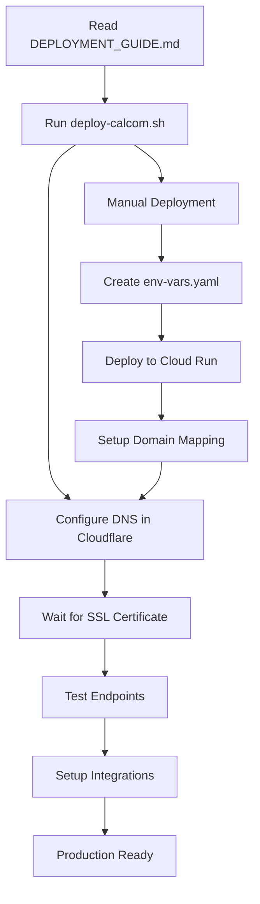

# Cal.com Deployment Documentation

This directory contains comprehensive documentation and tools for deploying Cal.com to production without errors.

## 📚 Documentation Files

### 🎯 [DEPLOYMENT_GUIDE.md](./DEPLOYMENT_GUIDE.md)
**The definitive deployment guide** - Use this for all production deployments.
- Step-by-step deployment process
- Common failure modes and solutions
- Debugging commands
- Pre/post-deployment checklists
- **Start here for any deployment**

### 📋 [WORKING_CONFIG.md](./WORKING_CONFIG.md)
**Exact working configuration reference** - The proven setup that works.
- Complete infrastructure configuration
- All 14 required environment variables
- Domain and DNS settings
- Health check results
- **Use this as your configuration template**

### 🔧 [INTEGRATION_SETUP.md](./INTEGRATION_SETUP.md)
**Integration configuration guide** - For setting up Google OAuth, Zoom, and 2FA.
- Google Calendar integration
- Google OAuth login setup
- Zoom integration
- 2FA configuration
- **Use this after successful deployment**

## 🛠️ Deployment Tools

### 🚀 [deploy-calcom.sh](./deploy-calcom.sh)
**Automated deployment script** - One-command deployment.
```bash
./deploy-calcom.sh
```
- Automated environment setup
- Service deployment with proper configuration
- Domain mapping
- Verification checks
- **Recommended for consistent deployments**

### 📄 [env-vars.yaml](./env-vars.yaml)
**Environment variables template** - Generated by deployment script.
- All required environment variables
- Proper formatting for Cloud Run
- **Auto-generated, don't edit manually**

## 🚦 Quick Start

### For New Deployments
1. **Read** [DEPLOYMENT_GUIDE.md](./DEPLOYMENT_GUIDE.md) first
2. **Run** `./deploy-calcom.sh` for automated deployment
3. **Configure DNS** in Cloudflare (gray cloud!)
4. **Wait** for SSL certificate provisioning
5. **Test** endpoints and Google OAuth

### For Troubleshooting
1. **Check** [DEPLOYMENT_GUIDE.md](./DEPLOYMENT_GUIDE.md) troubleshooting section
2. **Compare** your config with [WORKING_CONFIG.md](./WORKING_CONFIG.md)
3. **Run** debugging commands from the guide
4. **Verify** all checklist items are completed

### For Integration Setup
1. **Deploy** successfully first using guides above
2. **Follow** [INTEGRATION_SETUP.md](./INTEGRATION_SETUP.md) for integrations
3. **Test** each integration individually

## ⚠️ Critical Success Factors

Based on previous deployment failures, these are the most important factors:

### 1. Environment Variables (Most Common Failure)
- **Must have all 14 variables** set correctly
- **Both DATABASE_URL and DATABASE_DIRECT_URL** required
- **Use env-vars.yaml file** for deployment (not individual --set-env-vars)
- **Generate fresh secrets** for NEXTAUTH_SECRET and CALENDSO_ENCRYPTION_KEY

### 2. Memory Allocation (Second Most Common Failure)
- **Minimum 2GB (2048Mi)** memory allocation
- **Never use 512Mi** - causes memory exceeded errors
- **1GB works but 2GB is safer** for production

### 3. DNS Configuration (Third Most Common Failure)
- **Gray cloud in Cloudflare** (DNS only, not proxied)
- **CNAME to ghs.googlehosted.com** (not Cloudflare IPs)
- **Wait 5-10 minutes** for propagation and SSL provisioning

### 4. Database Connection
- **Use socket connection** (`/cloudsql/...`) not public IP
- **Both DATABASE_URL and DATABASE_DIRECT_URL** must be identical
- **Cloud SQL connector** must be attached to service

## 🔄 Deployment Process Summary



## 📊 Success Metrics

A successful deployment should show:
- ✅ Root endpoint returns 307 redirect
- ✅ `/auth/login` returns 200 OK
- ✅ No errors in Cloud Run logs
- ✅ All 14 environment variables present
- ✅ 2048Mi memory allocation
- ✅ Custom domain returns 200/307 (not 503)
- ✅ SSL certificate provisioned
- ✅ Google OAuth login works

## 🆘 When Things Go Wrong

1. **Don't panic** - these guides were created from actual failures
2. **Check the troubleshooting section** in DEPLOYMENT_GUIDE.md
3. **Compare your setup** with WORKING_CONFIG.md
4. **Run the debugging commands** provided in the guides
5. **Start fresh if needed** - delete service and redeploy

## 📅 Maintenance

- **Update secrets** periodically (NEXTAUTH_SECRET, CALENDSO_ENCRYPTION_KEY)
- **Monitor memory usage** and increase if needed
- **Check SSL certificate expiry** (auto-renewed by Google)
- **Update OAuth credentials** if they expire
- **Keep documentation updated** with any configuration changes

---

**Remember**: These guides were created from real deployment failures. Following them exactly will prevent the same issues from happening again.


